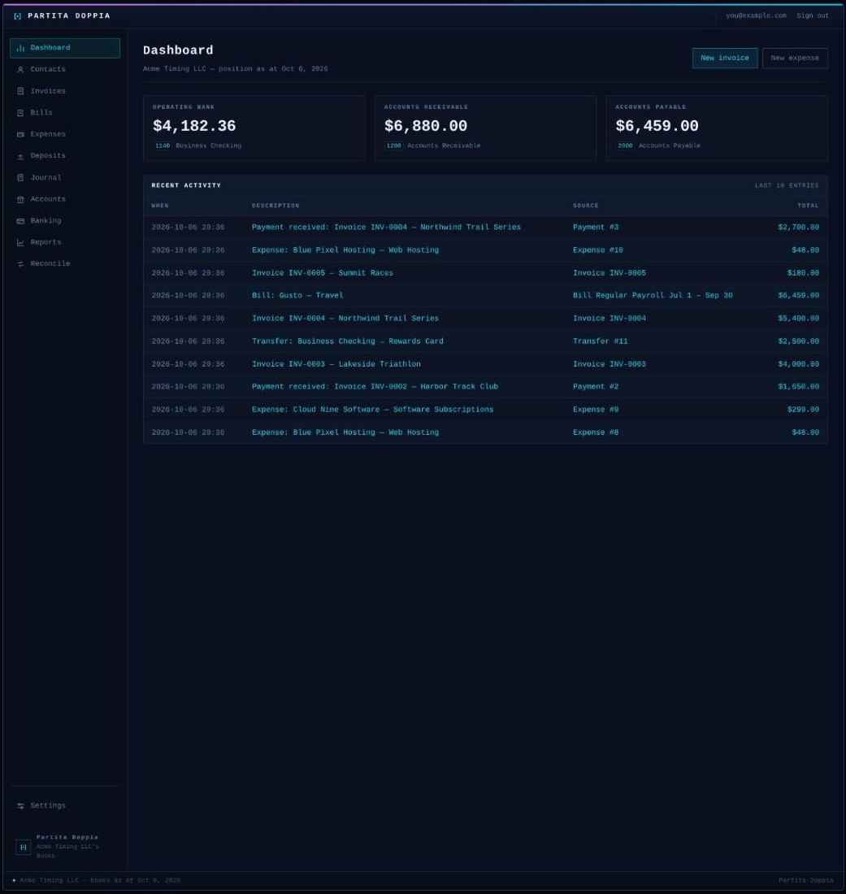
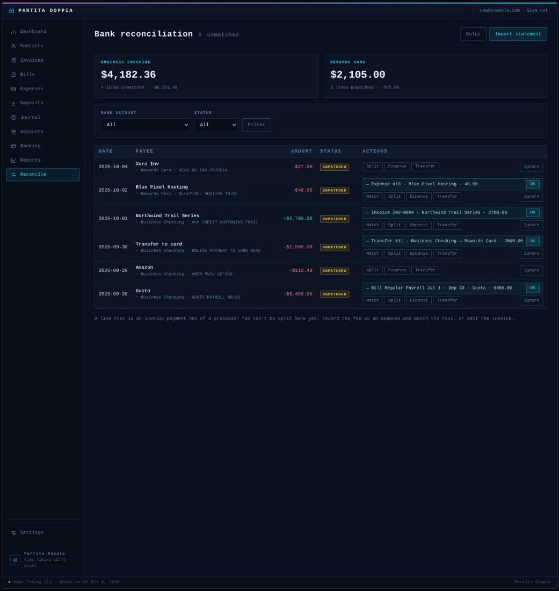
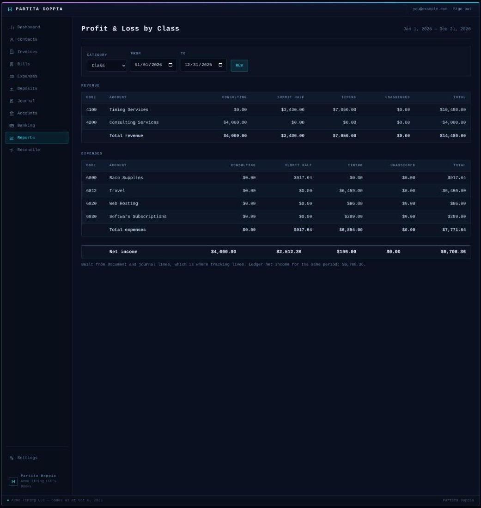
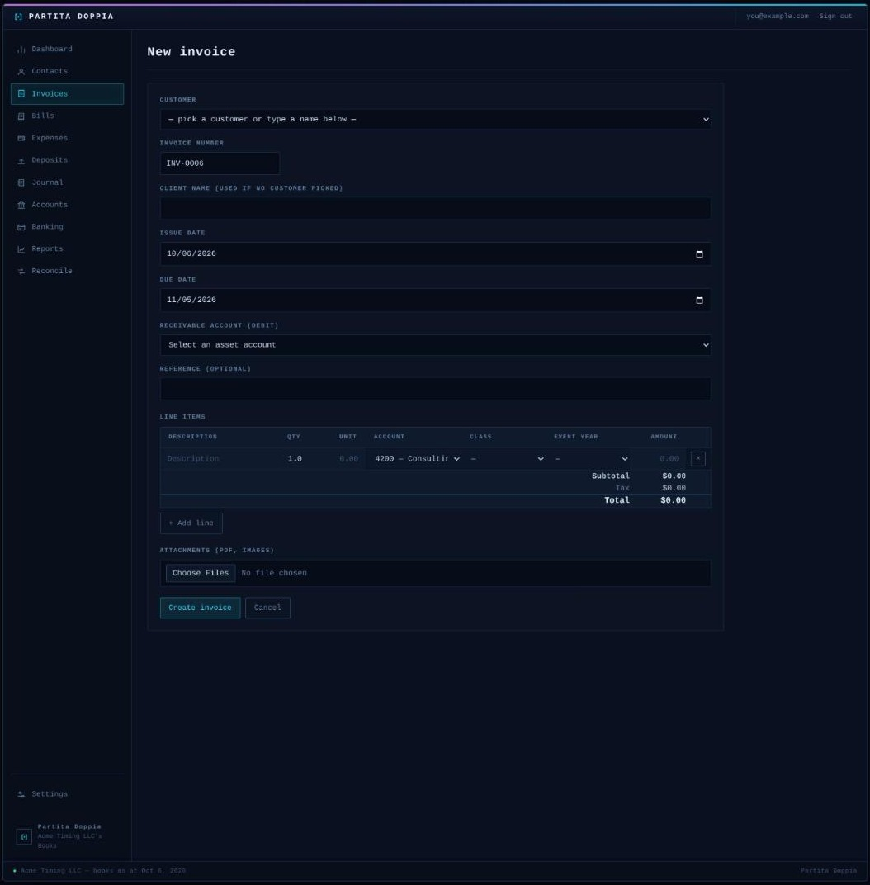

# Partita Doppia

Double-entry books for one small business. Invoices, bills, spend and receive
money, transfers, manual journals, bank reconciliation, Xero-style tracking
categories and the standard reports, in a Rails 8 app that runs on SQLite and
needs nothing else. Built by someone leaving Xero who wanted to keep the parts
that worked and own the rest.

*Partita doppia* is Italian for double entry. The name is always the two words
together.



## What it does

- **Every transaction is a document that posts to the ledger.** Invoices and
  bills accrue to receivables and payables and take payments. Expenses and
  deposits move money straight through a bank account. Transfers move it
  between two. Manual journals cover the rest. Each document carries line
  items, attachments, a history of who changed what, and can be edited, voided
  or deleted while nothing depends on it.
- **Bank reconciliation** against a nightly [SimpleFIN](https://bridge.simplefin.org)
  feed or uploaded CSV, OFX and QFX statements. Each line gets a ranked
  suggestion with a one-click OK, or you match it, split it across several
  documents, categorise it into a new expense or deposit, or pair it with its
  transfer counterpart in another account. Bank rules do the repetitive ones.
  Every match is undoable.
- **Tracking categories** the way Xero does them: up to two active categories,
  one option per category on any line, and a profit and loss broken out by
  option.
- **Reports:** profit and loss, balance sheet, trial balance, general ledger,
  receivables and payables aging, profit and loss by tracking category.
- **Invoicing:** numbered invoices with a PDF, emailed to the customer with the
  PDF attached, recurring invoices, and a per-document activity log.
- **Xero import over the API.** Connect a Xero app under Settings and pull the
  chart of accounts, tax rates, contacts, tracking categories, every invoice
  and bill with lines and payments, spend and receive money, transfers and
  manual journals. Re-running updates in place. Xero's own CSV exports upload
  as a fallback.
- **Passwordless sign-in.** Every sign-in emails a six-digit code. An
  installation can instead trust an SSO hub's cookie (see [Sign-in](#sign-in)).
- **Dark and light themes**, chosen per person, in a terminal-flavoured UI.





## Stack

Ruby 3.4, Rails 8, SQLite with the Solid suite for jobs, cache and cable,
Hotwire (Turbo and Stimulus over importmap, no build step), the
[plutus](https://github.com/mbulat/plutus) ledger, Prawn for PDFs, Minitest.
No Postgres, Redis, Node or Sidekiq.

## Quick start

```sh
git clone https://github.com/joelgaff/partita_doppia.git
cd partita_doppia
bin/setup                 # bundle, db:prepare, enables the pre-push hook
EDITOR=nano bin/rails credentials:edit
bin/rails server
```

The credentials need, at minimum, the keys shown in
[`config/credentials.yml.example`](config/credentials.yml.example):
`secret_key_base`, the Active Record encryption keys, `app.host`, and an SMTP
block so login codes and invoices can go out. Development delivers mail to the
browser through letter_opener instead, so SMTP can wait.

Open the site. With nobody signed in yet it shows **Set up your books**: name
the entity and the first person, confirm the email with a six-digit code, and
you're in. Add other people under **Settings → People**. The entity name shows
in the sidebar as "<name>'s Books".



## Bringing in Xero history

Register a Web app at [developer.xero.com](https://developer.xero.com/app/manage)
with the redirect URI `https://<your host>/settings/xero/callback`, put the
client id and secret under `xero:` in the credentials, then **Settings → Xero →
Connect** and **Run import**. Progress shows in the page as the steps complete.

Apps registered after March 2026 get only Xero's granular read scopes, which is
all this app asks for. Two things those scopes cannot reach: **conversion
balances** and journals Xero wrote on its own (depreciation, payroll). Enter
those once as a manual journal and the balance sheet lines up.

## Bank feed and statements

**Settings → Bank feed**: paste a SimpleFIN setup token, map the feed's accounts
onto yours, and new lines arrive every night. **Pull history** on the same page
backfills in 90-day windows. Statement files upload from **Settings → Imports
and data** or from any bank account's page. Lines carrying the bank's own id
dedupe on it, so re-uploading a statement is safe.

## Assumptions, stated

- One organisation per installation, one currency (shown as `$`), a calendar
  fiscal year. The schema scopes everything to an organisation, so multiple
  tenants are a routing change later, not a rewrite.
- Sales tax is a single rate on top of a line. Purchase tax folds into the cost
  unless a recoverable asset account is set on the rate.
- SimpleFIN is the only live feed. Everything else is a file.
- A bank line that is an invoice payment net of a processor fee is not a split
  the reconcile page can express yet. Record the fee as an expense and match
  the rest.

## Sign-in

The built-in mode is the default: email, code, session, with rate limits on
sends and attempts. If the credentials carry a `launchpad:` block (base URL,
issuer, cookie domain) the app instead trusts a
Launchpad SSO hub's cookie (the maintainer's private hub; the contract is a
signed JWT in a cookie on a shared domain) and the hub decides who gets in.
`AUTH_MODE=local` or `AUTH_MODE=launchpad` in the environment overrides the
choice, which is handy in development.

## Development

- `AUTH_MODE=local bin/dev` runs the app alone on port 3001. Without the
  override, `bin/dev` also boots a Launchpad checkout from beside the repo on
  port 3000 and expects you at http://accounting.lvh.me:3001, where the SSO
  cookie is scoped.
- `bin/ci` runs lint (`rubocop-rails-omakase`), bundler-audit, Brakeman, the
  importmap audit and the test suite. The pre-push hook that `bin/setup` enables
  runs the same thing before anything reaches GitHub.
- Mailer previews live at `/rails/mailers`.
- [`CLAUDE.md`](CLAUDE.md) holds the working notes on the domain model: how a
  document type implements the ledger interface, how imports and reconciliation
  are put together, and the conventions the code follows. Read it before adding
  a document type.
- [`CONTRIBUTING.md`](CONTRIBUTING.md) is short.

## Deploying

Any host that runs a Rails app with a writable disk for SQLite and a process
for Solid Queue will do. Set `RAILS_MASTER_KEY`, point `app.host` in the
credentials at your domain, and give the app an SMTP account. There is no
Dockerfile opinion beyond the one Rails generates. Operators keep notes for
their own installation outside this repository.

## License

[MIT](LICENSE).
